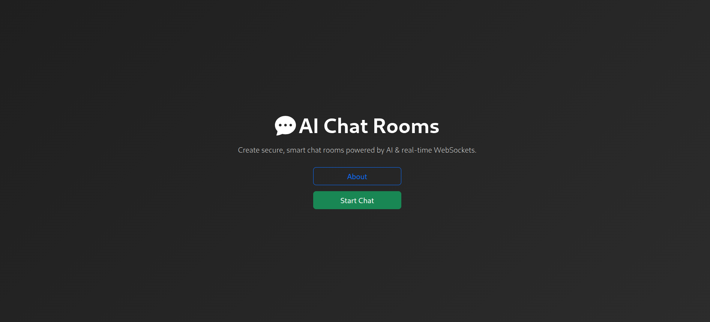

# 🤖 AI Chat Rooms

A modern, secure, and real-time AI-based chat application where users can create and join custom chat rooms with optional password protection. Messages are handled via WebSockets, and users authenticate via Google. Designed for speed, simplicity, and collaboration.

---

## 🚀 Features

- 🔐 **Custom Room Creation** with or without password
- 🌐 **Room Access via Link** (password-protected or public)
- 👤 **Google Authentication** (name and avatar used in chat)
- 💬 **Real-time Messaging** via WebSockets
- 🧠 **AI Message Intelligence** _(optional enhancement)_
- ⏳ **Temporary Chat Storage** (rooms are short-lived)
- 🛠️ **Admin Controls** (disband room)
- 📱 **Responsive Design** with Bootstrap 5

---

## 📸 Screenshots

| Homepage                    | Join Room Page              | Chat Interface              |
| --------------------------- | --------------------------- | --------------------------- |
|  |  |  |

---

## 🛠 Tech Stack

- **Frontend**: React, Bootstrap 5, Bootstrap Icons
- **Backend**: Node.js + Express _(planned)_
- **Realtime**: WebSocket (Socket.IO or native WebSocket)
- **Auth**: Google OAuth
- **Storage**: Temporary in-memory store or Redis (optional)

---

## 📦 Installation

```bash
git clone https://github.com/yourusername/ai-chat-rooms.git
cd ai-chat-rooms
npm install
npm run dev
```
